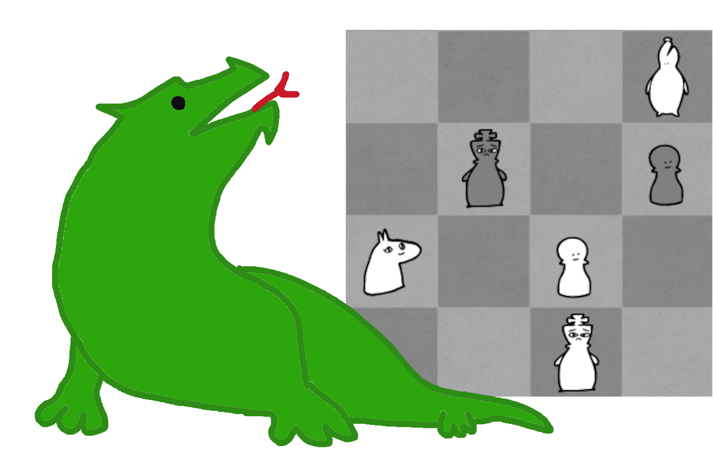

<h1 align="center">
Lizard - A C# chess engine
</h1>

<h2 align="center">

</h2>

Creating this in my spare time, mainly using it to learn more about optimization and computer games. 
I'm uploading it here so I can keep backups of it and not lose it when my laptop finally dies.

**To the dozen or so people that saw this repo before version 10.0:** This was formerly named "LTChess". 
This was an unfortunate choice of naming as that name was already taken by [Laurie Tunnicliffe](https://www.chessprogramming.org/Laurie_Tunnicliffe), 
who has a website for the true "LTChess" [here](https://ltchess.weebly.com/). Sorry Laurie!

## Ratings

| Version | Released | [CCRL 40/15](https://www.computerchess.org.uk/ccrl/4040/) | [CCRL Blitz](https://www.computerchess.org.uk/ccrl/404/) | Notes |
| ---- | ------------ | ---- | ---- | --- |
| 10.0 | Jan. 4 2024  | 3365 | 3406 | First non-Stockfish NNUE |
| 10.1 | Jan. 13 2024 | 3426 | -    | Various improvements to search |
| 10.2 | Feb. 9 2024 | 3498 | -    | Larger network, more tunes |

## Features
### NNUE Evaluation:
Version 10.2 uses a 768 -> 1536 -> 1 neural network to evaluate positions, which was trained on 2 billion positions of [an Lc0 dataset](https://drive.google.com/file/d/1RFkQES3DpsiJqsOtUshENtzPfFgUmEff/view) using [Bullet](https://github.com/jw1912/bullet).

In addition, this engine can use [Stockfish neural networks](https://tests.stockfishchess.org/nns) created for their [SFNNv6/7/8 architectures](https://github.com/official-stockfish/Stockfish/commit/c1fff71650e2f8bf5a2d63bdc043161cdfe8e460), a diagram of which is available [here](https://raw.githubusercontent.com/official-stockfish/nnue-pytorch/master/docs/img/SFNNv6_architecture_detailed.svg).
For the sake of simplicity, this functionality is only possible on the [the HalfKA-HalfKP branch](../../tree/HalfKA-HalfKP).

### Other things:
  - [Aspiration Windows](https://www.chessprogramming.org/Aspiration_Windows)
  - [Futility Pruning](https://www.chessprogramming.org/Futility_Pruning)
  - [Delta Pruning](https://www.chessprogramming.org/Delta_Pruning)
  - [Late Move Reductions](https://www.chessprogramming.org/Late_Move_Reductions)
  - [Null Move Pruning](https://www.chessprogramming.org/Null_Move_Pruning)
  - [Late Move Pruning](https://www.chessprogramming.org/Futility_Pruning#MoveCountBasedPruning)
  - [Reverse Futility Pruning](https://www.chessprogramming.org/Reverse_Futility_Pruning)
  - [Killer Heuristic](https://www.chessprogramming.org/Killer_Heuristic)
  - [History Heuristic](https://www.chessprogramming.org/History_Heuristic)

## Some spotty history:
#### Version 9.3:
Uses its own NNUE evaluation, and began proper parameter testing with [SPRT](https://en.wikipedia.org/wiki/Sequential_probability_ratio_test).
9.3.1 was the last version to be named "LTChess".

#### Version 9.1:
Some major speed improvements to both searches and move generation.
It was rated a bit above 2500 bullet/blitz on Lichess.

#### Version 8.4:
A decent rating increase, and a lot fewer "dumb" moves. 
Many of the commits between 8.0 and 8.4 improved some of the early architectural decisions, and it is now far easier to debug and improve the code. 
It was rated a bit above 2400 bullet/blitz on Lichess.

#### Version 7.0:
A large rating increase (around 250) and was far more polished. 
It was rated a bit above 2000 bullet on Lichess.

## Contributing
If you have any ideas or comments, feel free to create an issue or pull request!
